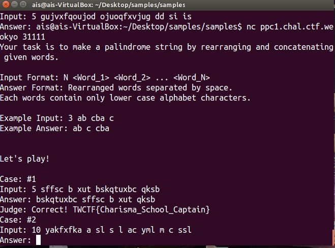
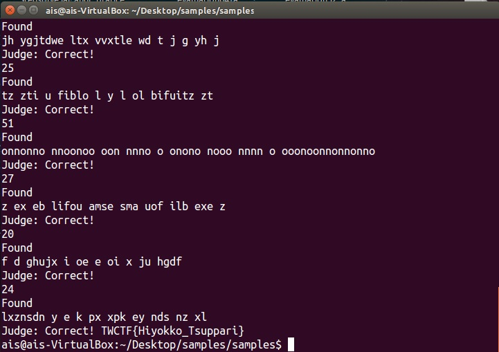

#Make a Palindrome! 

Problem
======================================================================================
Your task is to make a palindrome string by rearranging and concatenating given words.

Input Format: N <Word_1> <Word_2> ... <Word_N>
Answer Format: Rearranged words separated by space.
Each words contain only lower case alphabet characters.

Example Input: 3 ab cba c
Example Answer: ab c cba

You have to connect to ppc1.chal.ctf.westerns.tokyo:31111(TCP) to answer the problem.

$ nc ppc1.chal.ctf.westerns.tokyo 31111

    Time limit is 3 minutes.
    The maximum number of words is 10.
    There are 30 cases. You can get flag 1 on case 1. You can get flag 2 on case 30.
    samples.7z Server connection examples.
-------------------------------------------------------------------------------------

題目有兩小題共30個例子：
1. You can get flag 1 on case 1. 
2. You can get flag 2 on case 30.
```
ais@ais-VirtualBox:~/Desktop/samples/samples$ nc ppc1.chal.ctf.westerns.tokyo 31111
Your task is to make a palindrome string by rearranging and concatenating given words.

Input Format: N <Word_1> <Word_2> ... <Word_N>
Answer Format: Rearranged words separated by space.
Each words contain only lower case alphabet characters.

Example Input: 3 ab cba c
Example Answer: ab c cba


Let's play!

Case: #1
Input: 5 sffsc b xut bskqtuxbc qksb
```

觀察一陣子後發現因是回文題，需要照著題目格式，重新排列組合為可回文的順序。

像是這題：

5 表示有5個 strings ，於是答案為："bskqtuxbc sffsc b xut qksb"

```Flag 1:TWCTF{Charisma_School_Captain}```



Flag 2:``````

